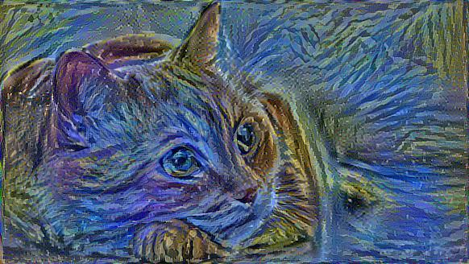

## EzArt
My final project for my Python Development course at the University of Pennsylvania, using Python and Tkinter to create a front-end for the Style Transfer CNN along with a headless Selenium web scraper to provide source images.

Disclaimer: The detailed implementation of the tensorflow algorithm will be from referencing an outside source as it contains material that is beyond the current expectation of the class. ([Source](https://github.com/llSourcell/How_to_do_style_transfer_in_tensorflow/blob/master/Style_Transfer.ipynb))

## Project Outline:

The project will entail the user inputting a sentence of an artist drawing an object (e.g. “Van Gogh draws cat”) and the output will be an image that was found from Google Search that is stylized to Van Gogh’s style from a preset of data. The main part of this project will be the regular expression parsing of the input into variables that can be taken in, using the style transfer algorithm implemented with TensorFlow, and output it to the user.

## Modules used:
1) Selenium: in the file ImgFetcher, line 28-44, visits the url to return the hmtl of the page to parsed
2) Requests: in EzArt, line 30 - 34, used to download the links 
3) tkinter: in EzArt, line 142 - 167, used to create the GUI
4) numpy: in EzArt, line 61 - 64, used to permute arrays
5) os: in EzArt, line 24 - 28, used to create os path
6) shutil: in EzArt, line 34, used to save images
7) PIL: in EzArt, line 69 - 80, used to load image and resize
8) functools, cv2, skimage.io, and tensorflow used in StyleTransfer, credited to jimmyyhwu not me

Customer class: Downloader
    Lines: 19 to 35 in EzArt, customer str class for debugging use

Generator: in StyleTransfer, style_transfer method
    Used in EzArt, line 116 to 134, to generate the next iteration of the transfer style image, to update the gui
    
## Features:
1) EzArt: Allows the user to input 2 strings that will then promptly fetch using the ImgFetcher to display a 
sample of the image, and then shows the progressing, updating style transfer image on the gui as well
2) ImgFetcher: given a query, searches it up on an image website, then retrieve the related image links
3) Saves the content, stlye, and resulting image to the local file system

## How-to-use:
Please have the following modules imported/installed:
- functools
- cv2 (opencv-contrib-python )
- numpy
- os
- skimage.io
- tkinter
- shutil
- PIL
- Setup selenium: https://pypi.python.org/pypi/selenium#downloads
- vgg19: Save to the file folder by downloading npy for vgg16 (548mb)from https://github.com/machrisaa/tensorflow-vgg
    at : https://mega.nz/#!xZ8glS6J!MAnE91ND_WyfZ_8mvkuSa2YcA7q-1ehfSm-Q1fxOvvs

Run EzArt.py

## Demo:
With the input "van gogh draws cat"
